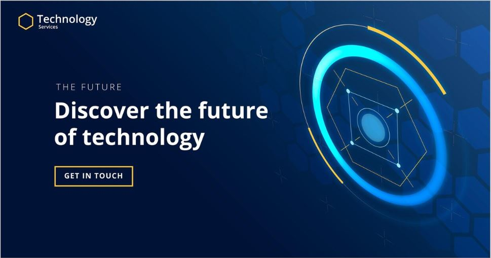

# 🌐 Building Robust Digital Foundations: Software & Middleware Architecture

> *Naveen Ganesh – Software Architect | 16+ Years of Experience*

---

Welcome to my blog! I'm **Naveen Ganesh**, a seasoned Software Architect with over 16 years of experience in **designing scalable**, **resilient**, and **adaptive** enterprise software systems.

My core areas of expertise include:

- 🧠 **Software Architecture**
- 🧩 **Middleware Architecture**
- 🛠️ **Service Orchestration**
- 📊 **Data Abstraction**

---

## 🏗️ Software Architecture: Designing for Change

> “Good architecture enables change with minimal pain.”

Software architecture defines the high-level structure of a system, focusing on:

✅ **Modularity**  
✅ **Maintainability**  
✅ **Performance**  
✅ **Scalability**

### 🧰 My Architectural Practices:
- **SOLID principles** and **GoF Design Patterns**
- **Domain-Driven Design (DDD)** – to structure the core domain logic
- **Separation of Concerns (SoC)** – isolating layers and components
- **Cloud-native patterns** – containers, microservices, CI/CD pipelines

> 📌 *Architecture is not about today—it’s about anticipating tomorrow’s changes.*

---

## 🔌 Middleware Architecture: The Integration Backbone

Middleware glues together diverse systems, protocols, and data formats. It enables **communication**, **transformation**, and **governance** in a hybrid digital landscape.

### 💡 Core Middleware Patterns:
- 📨 **Message Brokers**: Kafka, Azure Event Grid, RabbitMQ
- 🛡️ **API Gateways**: Authentication, throttling, routing
- 🧱 **Queue-based Decoupling**: Ensures fault-tolerant, loosely coupled systems
- 🔍 **Cross-cutting concerns**: Logging, security, telemetry, data mapping

> 🔄 Middleware makes integration **resilient**, **secure**, and **maintainable**.

---

## ⚙️ Service Orchestration: Coordinating the Digital Workforce

Microservices need orchestration to function as a unified application. It brings **order**, **monitoring**, and **resilience** to service workflows.

### 🧭 My Orchestration Strategy:
- **Orchestration vs Choreography**: Use orchestration for centralized control
- **Workflow Engines**: Durable Functions, Logic Apps, Camunda
- **Resilience Patterns**: Retry, circuit breakers, timeout handling
- **Event-Driven Architecture**: Responsive and scalable integrations

> 🛠️ *Orchestration provides observability and control across distributed systems.*

---

## 🧱 Data Abstraction: Hide Complexity, Expose Value

Data abstraction streamlines how services interact with data sources, ensuring **consistency**, **security**, and **version control**.

### 🧵 Abstraction Techniques I Use:
- **Repository & Unit of Work Patterns** – isolate data access logic
- **DTOs (Data Transfer Objects)** – decouple service and transport layers
- **API Layer Abstractions** – maintain versioned, stable contracts
- **GraphQL / OData** – enable flexible and efficient queries

> 🧩 *Clean abstractions reduce coupling and boost agility.*

---

## 📢 Let's Connect!

If you're excited about **resilient architecture**, **middleware innovation**, or solving real-world **integration challenges**, this blog is for you.

Expect future posts on:

- 🔍 Deep dives into architecture patterns  
- 🧑‍🏫 Engineering leadership & mentoring  
- 🛠️ Refactoring legacy systems  
- ☁️ Cloud-native transformation strategies  

> 🔗 **Follow me on [LinkedIn](https://www.linkedin.com/in/naveenganesh)** | 💬 **Reach out for consulting/training/collaboration**

---

> *Naveen Ganesh | Software Architect | 16+ Years in Scalable System Design*

---

